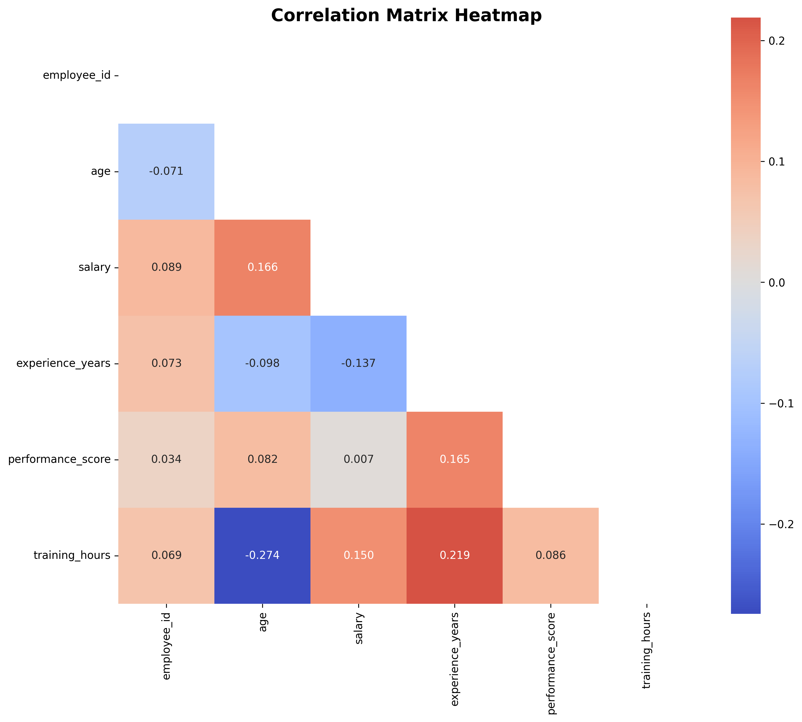
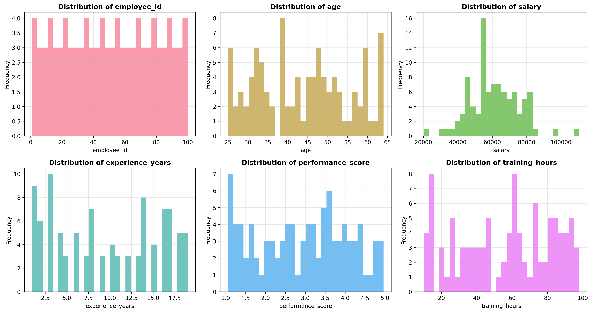
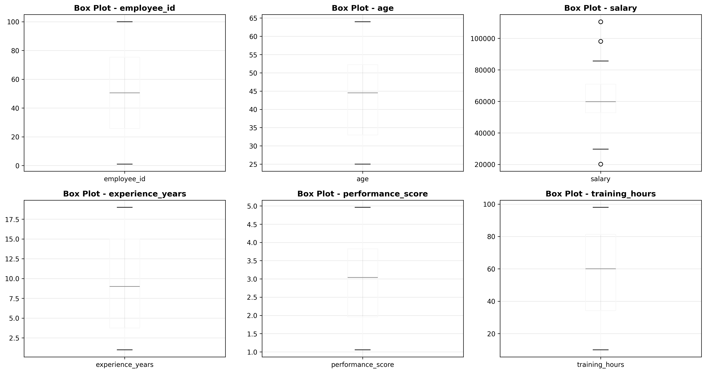

# Analysis Report - comprehensive_test_data

**Generated on:** 2025-08-15 16:52:42

**Data Shape:** 100 rows × 8 columns

---

## 📋 Table of Contents

1. [📊 Basic Statistical Analysis](#-basic-statistical-analysis)
2. [🔗 Correlation Analysis](#-correlation-analysis)
3. [📈 Data Distributions](#-data-distributions)
4. [🎯 Outlier Analysis](#-outlier-analysis)
5. [🤖 Machine Learning Analysis](#-machine-learning-analysis)
6. [🎯 Clustering Analysis](#-clustering-analysis)
7. [📈 Time Series Analysis](#-time-series-analysis)
8. [🔍 Data Quality Assessment](#-data-quality-assessment)
9. [📋 Summary and Recommendations](#-summary-and-recommendations)

## 📊 Basic Statistical Analysis

### Data Overview

### Data Overview

| Metric              |   Value |
|:--------------------|--------:|
| Total Rows          |     100 |
| Total Columns       |       8 |
| Numeric Columns     |       6 |
| Categorical Columns |       2 |
| Missing Values      |      10 |

## 🔗 Correlation Analysis

### Correlation Matrix

|   employee_id |    age |   salary |   experience_years |   performance_score |   training_hours |
|--------------:|-------:|---------:|-------------------:|--------------------:|-----------------:|
|         1.000 | -0.071 |    0.089 |              0.073 |               0.034 |            0.069 |
|        -0.071 |  1.000 |    0.166 |             -0.098 |               0.082 |           -0.274 |
|         0.089 |  0.166 |    1.000 |             -0.137 |               0.007 |            0.150 |
|         0.073 | -0.098 |   -0.137 |              1.000 |               0.165 |            0.219 |
|         0.034 |  0.082 |    0.007 |              0.165 |               1.000 |            0.086 |
|         0.069 | -0.274 |    0.150 |              0.219 |               0.086 |            1.000 |

## 📈 Data Distributions

## 🎯 Outlier Analysis

## 🎯 Clustering Analysis

## 🔍 Data Quality Assessment

## 📋 Summary and Recommendations

### Key Findings

• **Dataset Size**: 100 rows and 8 columns

• **Missing Data**: 1.25% of total data points

• **Column Types**: 6 numeric, 2 categorical

• **Correlations**: Analyzed relationships between numeric variables

• **Clustering**: Identified natural groupings in the data

### Recommendations

• Review data quality issues identified in the assessment

• Consider feature engineering based on correlation analysis

• Investigate outliers detected in the analysis

• Use clustering insights for data segmentation strategies

